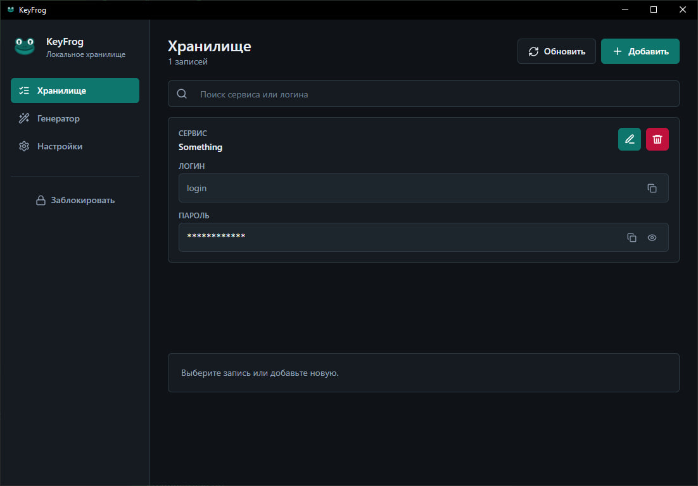
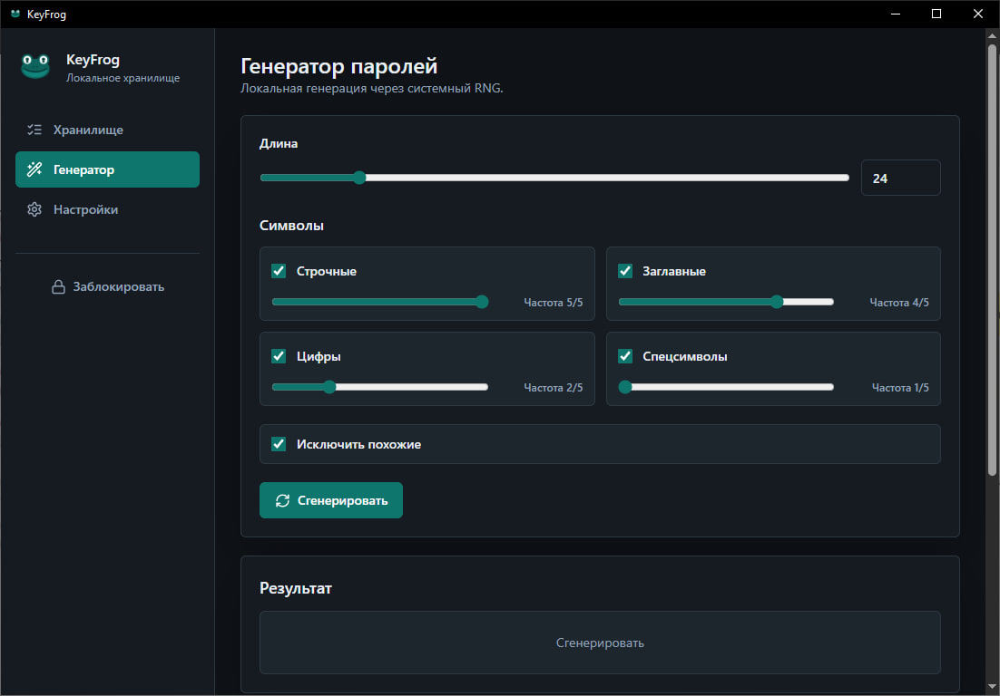
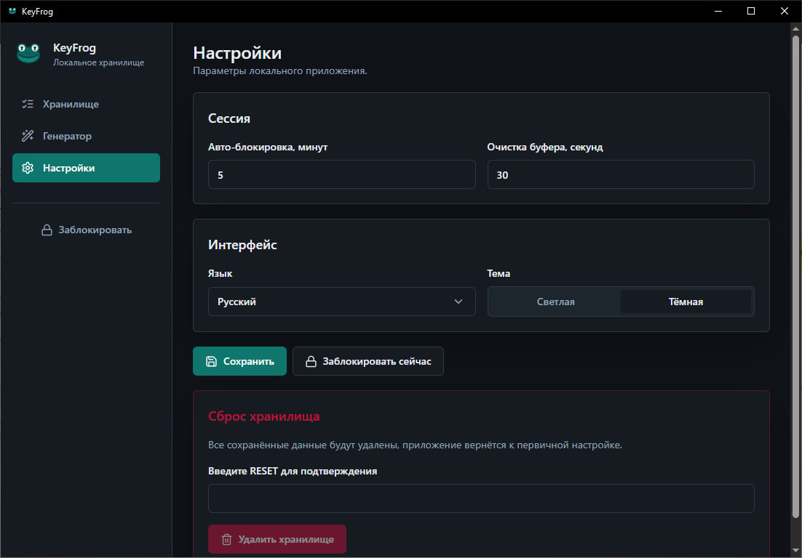

# KeyFrog

KeyFrog - локальный менеджер паролей для ПК. Приложение хранит данные на устройстве пользователя, открывается по мастер-паролю и не использует серверную часть.

> Проект находится на этапе первой рабочей версии. Перед использованием для реально важных данных рекомендуется провести дополнительное тестирование и аудит безопасности.

## Скриншоты

### Хранилище



### Генератор паролей



### Настройки



## Возможности

- создание локального зашифрованного хранилища;
- вход по мастер-паролю;
- полный сброс хранилища, если мастер-пароль забыт;
- добавление, редактирование и удаление записей;
- хранение названия сервиса, логина и пароля;
- скрытие пароля звездочками с возможностью просмотра;
- копирование логина и пароля;
- генератор надежных паролей;
- настройка длины, наборов символов и частоты типов символов;
- сохранение паттернов генерации паролей;
- русская и английская локализация;
- светлая и темная тема интерфейса.

## Стек

- **Desktop:** Tauri 2
- **Backend:** Rust
- **Frontend:** React, TypeScript, Vite
- **Стили:** Tailwind CSS
- **Хранилище:** SQLite
- **Шифрование:** Argon2id + XChaCha20-Poly1305
- **Случайность:** криптографически стойкий генератор ОС

## Безопасность

Мастер-пароль не сохраняется в открытом виде и не хранится как строка для последующей проверки.

При первичной настройке:

1. Генерируется случайная соль для KDF.
2. Из мастер-пароля через Argon2id выводится ключ шифрования ключа.
3. Генерируется отдельный ключ шифрования данных.
4. Ключ данных шифруется через XChaCha20-Poly1305.
5. В SQLite сохраняются только соль, nonce и зашифрованный ключ данных.

При входе приложение повторно выводит ключ из введенного мастер-пароля и пытается расшифровать ключ данных. Если расшифровка не удалась, мастер-пароль считается неверным.

Если мастер-пароль забыт, восстановить данные нельзя. Единственный сценарий - полный сброс vault-а с удалением локального хранилища и созданием нового.

## Установка зависимостей

Для разработки нужны:

- Node.js;
- npm;
- Rust;
- системные зависимости Tauri для вашей ОС.

Установка npm-зависимостей:

```bash
npm install
```

## Запуск в режиме разработки

```bash
npm run tauri -- dev
```

Если нужно запустить только frontend:

```bash
npm run dev
```

## Проверка и сборка

Проверка frontend:

```bash
npm run build
```

Проверка Rust-кода:

```bash
cd src-tauri
cargo check
```

Сборка desktop-приложения:

```bash
npm run tauri -- build
```

Debug-сборка:

```bash
npm run tauri -- build --debug
```

Готовые сборки Tauri появляются в:

```text
src-tauri/target/release/bundle/
src-tauri/target/debug/bundle/
```

## Структура проекта

```text
.
|-- docs/
|   `-- ARCHITECTURE.md
|-- src/
|   |-- app/              # верхний уровень приложения и общие типы
|   |-- assets/           # логотип и статические ассеты
|   |-- components/ui/    # локальные UI-компоненты
|   |-- features/         # auth, vault, generator, settings
|   |-- lib/              # обертки над Tauri API, i18n, clipboard
|   |-- main.tsx
|   `-- styles.css
`-- src-tauri/
    |-- capabilities/
    |-- icons/
    |-- src/              # Rust-модули приложения
    |-- Cargo.toml
    `-- tauri.conf.json
```

## Документация

Подробное описание архитектуры находится в [docs/ARCHITECTURE.md](docs/ARCHITECTURE.md).

Инструкция по ручной публикации релиза находится в [docs/RELEASE.md](docs/RELEASE.md).

История изменений находится в [CHANGELOG.md](CHANGELOG.md).

## Лицензия

Проект распространяется под лицензией MIT. Подробности находятся в [LICENSE](LICENSE).

## Текущий статус

Первая версия подготовлена как локальное desktop-приложение с базовым vault-функционалом, генератором паролей, настройками интерфейса и локализацией.

Перед публикацией релиза желательно дополнительно проверить:

- сценарии сброса vault-а;
- ввод неверного мастер-пароля;
- копирование и очистку буфера обмена;
- адаптивность интерфейса на разных размерах окна;
- установщик Tauri на чистой системе.
